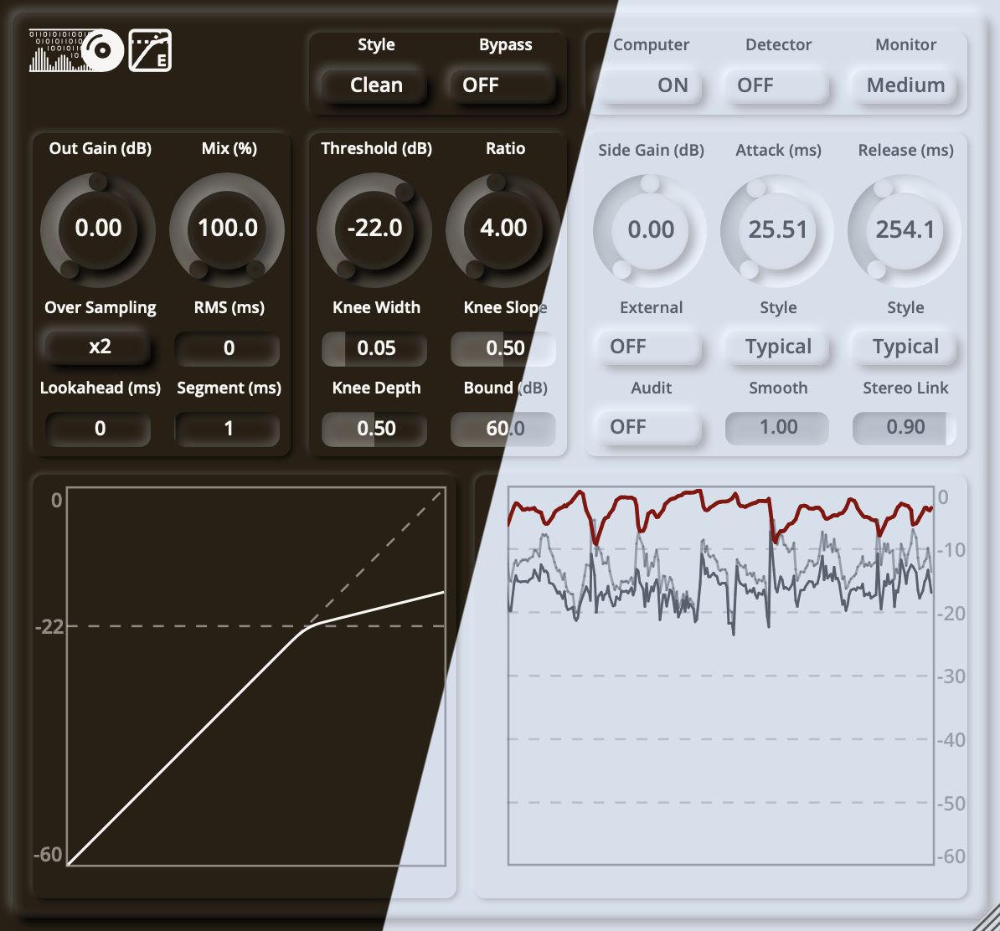

  
  

# ZLEComp

ZLEComp is a compressor plugin.

## Usage

See the wiki for details.

## Download

See the releases for the latest version. 

**Please NOTICE**:
- the installer has **NOT** been notarized/EV certificated on macOS/Windows
- the plugin has **NOT** been fully tested on DAWs

## Build from Source

0. `git clone` this repo

1. [Download CMAKE](https://cmake.org/download/) if you do not have it.

2. Populate the latest JUCE by running `git submodule update --init` in your repository directory.

3. Follow the [JUCE CMake API](https://github.com/juce-framework/JUCE/blob/master/docs/CMake%20API.md) to build the source.

## License

ZLEComp has a GPL license, as found in the [LICENSE](LICENSE) file.

Copyright (c) 2023 - [zsliu98](https://github.com/zsliu98)

JUCE framework from [JUCE](https://github.com/juce-framework/JUCE)

JUCE template from [pamplejuce](https://github.com/sudara/pamplejuce)

Font from CMU Open Sans, Font Awesome and MiSans.

[REAPER Forums](https://forums.cockos.com/showthread.php?t=205452)

Reiss, J. D., & McPherson, A. (2014). Audio effects: theory, implementation and application. CRC Press.

Giannoulis, D., Massberg, M., & Reiss, J. D. (2012). Digital dynamic range compressor design—A tutorial and analysis. Journal of the Audio Engineering Society, 60(6), 399-408.